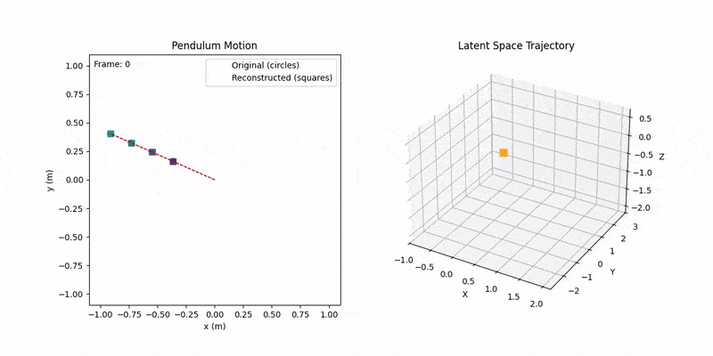
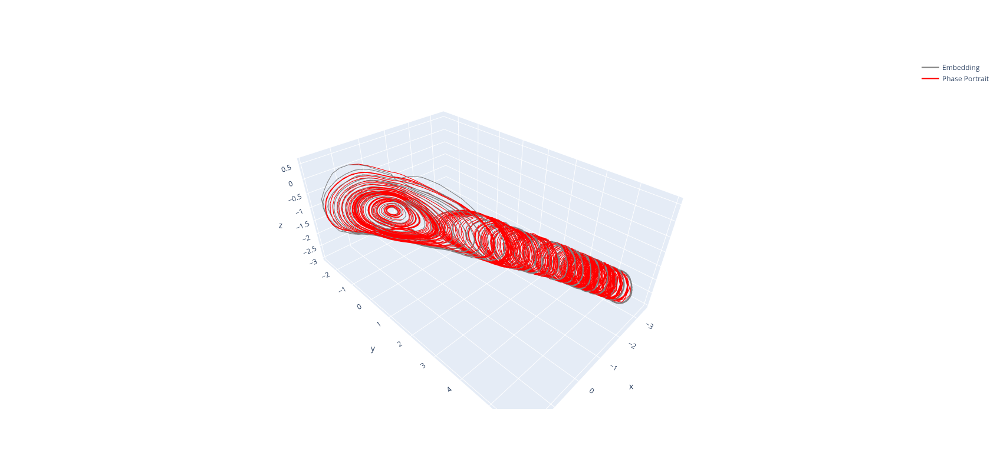

# Pendulum Test Suite

This library contains functionality for training various machine learning architectures on the simple pendulum task.



## Installation

To install the dependencies, run

```bash
bash install.sh
```

Rename the file .\_env to .env and fill in the values to set up wandb logging.

To generate all data required for the pre-configured experiments, run

```bash
bash generate_data.sh
```

## Running Experiments

To run a set of experiments with different model architectures using the same set of hyperparameters, use the following command

```bash
bash run_all_experiments.sh -c config.txt
```

Check the configuration file config.txt in the repo to see the expected format.

To run the set of experiments for different hyperparameters, use the following command

```bash
bash meta_run_all.sh -c meta_config_undamped.txt
```

## Results

By default, various metrics are calculated for each experiment. These are logged to wandb and are generally not saved locally. It is recommend to carefully label each experiment using meaningful tags.

An important output is the visualisation of the latent space structures.



This image shows the structure produced by the encoder in grey and the phase portrait produced by the dynamics module in red. Our experiments show that good alignment between these structures correlates strongly with good trajectory rollout performance.
